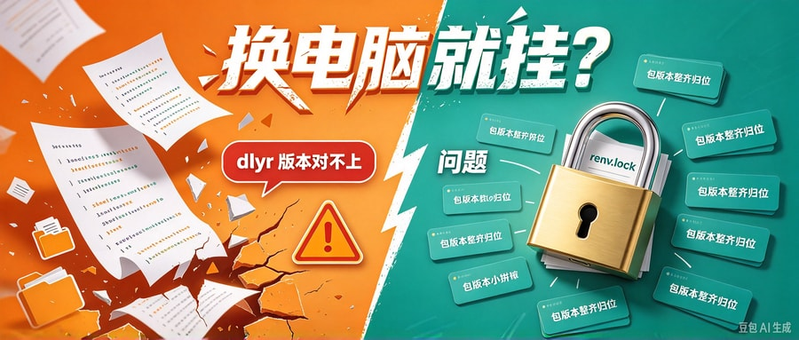
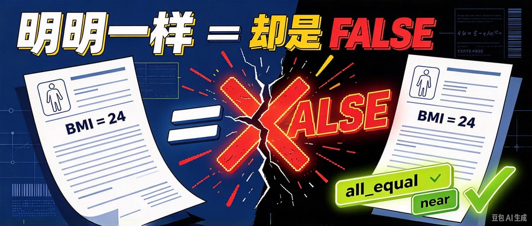
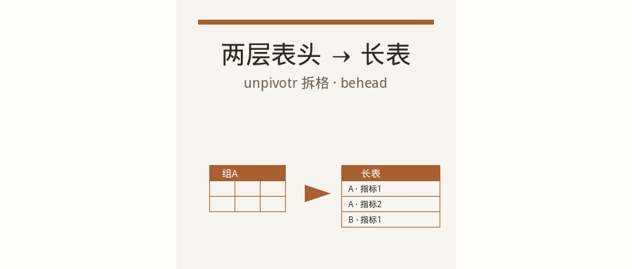
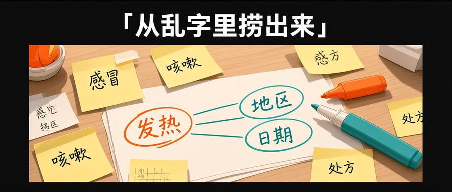
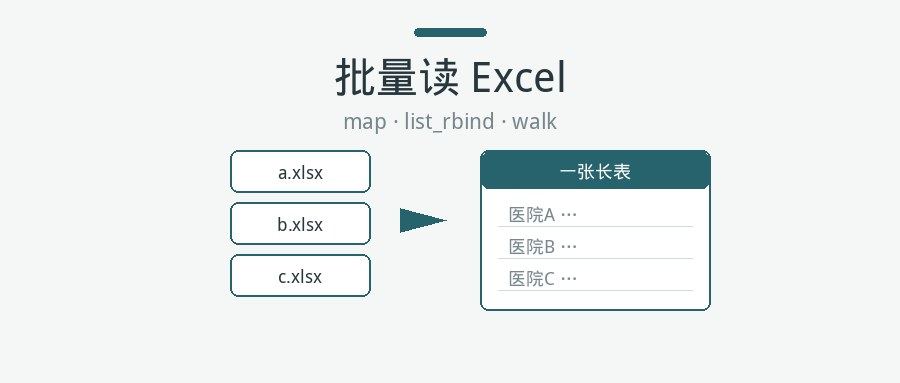

# RPost 封面一览

> 由 `cover/cover.json` 生成；改清单后运行 `node scripts/update-cover-md.mjs`。
>
> 合计 **13** 篇 · 已启用 **13** · 待制作（inactive）**0**

## R语言师兄脚本换台电脑就挂：用 renv 锁住包版本

- id：`20261007-renv-lockfile`
- 状态：**启用**
- 文件：`images/20261007-renv-lockfile.jpg`



- prompt：

```text
比例 2.35:1，成品像素 900×383，横版封面，无水印；只出 1 张终稿，不要中间稿。
油管/B站缩略图风，高对比大字钩子：「换电脑就挂？」
冲突画面：左侧拷来的脚本碎裂、dplyr 版本对不上；右侧一把挂锁锁住 renv.lock 文件，包版本整齐归位。暖橙+青绿。
不要代码墙、公式墙、水印、二维码、小图拼版。
```

> doubao trial keep 2026-10-07

## R语言里两个数明明一样，用 == 却是 FALSE

- id：`20261007-float-equality-near`
- 状态：**启用**
- 文件：`images/20261007-float-equality-near.jpg`



- prompt：

```text
比例 2.35:1，成品像素 900×383，横版封面，无水印；只出 1 张终稿，不要中间稿。
油管/B站缩略图风，高对比大字钩子：「明明一样，== 却是 FALSE」
冲突画面：两边打印都是 24 的 BMI，中间 == 裂开打大红叉；旁边 all.equal / near 亮起绿勾。高对比插画。
不要代码墙、公式墙、水印、二维码、小图拼版。
```

> doubao trial keep 2026-10-07

## R语言Excel两层表头怎么读：先拆格子再拼成长表

- id：`20261007-excel-multiheader-unpivotr`
- 状态：**启用**
- 文件：`images/20261007-excel-multiheader-unpivotr.jpg`



- prompt：

```text
LAYOUT MASK：白空、只画黑带；黑带内四周留 margin。油管缩略图。钩子「两层表头乱成一团？」。脏两层 Excel（基线/随访合并空格）+红叉 vs 长表 id/group/measure/value+绿勾。暖橙+青绿。无代码墙、无水印。
```

> automation regen 2026-10-07

## R语言住院天数很偏，t 置信区间不够稳时用 bootstrap

- id：`20261007-bootstrap-bca-skew`
- 状态：**启用**
- 文件：`images/20261007-bootstrap-bca-skew.jpg`


- prompt：

```text
LAYOUT MASK：白空、只画黑带；黑带内四周留 margin。油管缩略图。钩子「住院天数很偏？」。右偏住院天数直方图+警告「t区间」 vs BCa 徽章+病床。暖橙+青绿。无代码墙、无水印。
```

> automation regen 2026-10-07

## R语言按分组各跑一遍分析：每家医院一个回归

- id：`20261006-repeat-analysis-by-group`
- 状态：**启用**
- 文件：`images/20261006-repeat-analysis-by-group.jpg`


- prompt：

```text
LAYOUT MASK：白空、只画黑带；黑带内四周留 margin。油管缩略图。钩子「复制改名又漏了？」。三张都写市一的便利贴+红叉 vs 四家医院→nest+map→tidy results。暖橙+青绿。无代码墙、无水印。
```

> automation regen 2026-10-07

## R语言给变量重新分组：从 ifelse 到 case_when

- id：`20261006-recode-ifelse-case-when`
- 状态：**启用**
- 文件：`images/20261006-recode-ifelse-case-when.jpg`


- prompt：

```text
LAYOUT MASK：白空、只画黑带；黑带内四周留 margin。油管缩略图。钩子「切 BMI 档写乱了？」。左侧嵌套套娃+三枚 ifelse 芯片+红戳「肥胖→正常」+红叉；右侧 case_when 芯片+偏瘦/正常/超重/肥胖阶梯+绿勾。暖橙+青绿。无代码墙、无水印。
```

> automation fill 2026-10-07

## R语言 d/p/q/r 四个函数：查临界值、算 P 值、造模拟数据

- id：`20261006-dpqr-distributions`
- 状态：**启用**
- 文件：`images/20261006-dpqr-distributions.jpg`


- prompt：

```text
LAYOUT MASK：白空、只画黑带；黑带内四周留 margin。油管缩略图。钩子「不翻表查 1.96？」。翻飞统计表+红叉 vs qnorm→1.96 徽章+d/p/q/r 芯片+骰子+正态曲线轮廓+绿勾。暖橙+青绿。无代码墙、无水印。
```

> automation fill 2026-10-07

## R语言：同一批人测了三次，分数还不正态，怎么比？

- id：`20261005-friedman-repeated-scores`
- 状态：**启用**
- 文件：`images/20261005-friedman-repeated-scores.jpg`


- prompt：

```text
LAYOUT MASK：白空、只画黑带；黑带内四周留 margin。油管缩略图。钩子「三次疼痛分不正态？」。同一病人三表盘术前/术后1天/术后7天+ANOVA 红叉 vs Friedman+Wilcoxon 奖牌排名+绿勾。暖橙+青绿。无代码墙、无水印。
```

> automation fill 2026-10-07

## R 语言里随访宽表怎么转成长表

- id：`20260927-wide-to-long`
- 状态：**启用**
- 文件：`images/20260927-wide-to-long.jpg`


- prompt：

```text
LAYOUT MASK：白空、只画黑带；黑带内四周留 margin。油管缩略图。钩子「宽表怎么拧成长表」。宽表 vs 长表+箭头。青绿+橙。无水印。
```

> ref white+black + inset margin 2026-10-07

## 如何用正则从字符串里提取数据

- id：`20260927-regex-extract-data`
- 状态：**启用**
- 文件：`images/20260927-regex-extract-data.jpg`



- prompt：

```text
LAYOUT MASK：白空、只画黑带；黑带内四周留 margin。生活感横图。钩子「从乱字里捞出来」。桌面便签乱字里荧光笔圈出发热/地区/日期。暖橙+青绿。无代码墙、无水印。
```

> automation fill 2026-10-07

## 一百个 Excel 怎么一次读进来

- id：`20260927-batch-read-without-for`
- 状态：**启用**
- 文件：`images/20260927-batch-read-without-for.jpg`



- prompt：

```text
LAYOUT MASK：白空、只画黑带；黑带内四周留 margin。生活感横图。钩子「一百份一次收齐」。散落文件夹+红叉 vs 收进同一文件筐+绿勾。暖橙+青绿。无代码墙、无水印。
```

> automation fill 2026-10-07

## 啥是正则表达式？先会认文本形状

- id：`20260921-regex-real-world`
- 状态：**启用**
- 文件：`images/20260921-regex-real-world.jpg`


- prompt：

```text
LAYOUT MASK：白空、只画黑带；黑带内四周留 margin。生活感横图。钩子「先会认形状」。参差纸条上透明模板框住同形状标签。暖橙+青绿。无代码墙、无水印。
```

> automation fill 2026-10-07

## 分析做到一半如何存临时数据？

- id：`20260921-r-save-five-methods`
- 状态：**启用**
- 文件：`images/20260921-r-save-five-methods.jpg`


- prompt：

```text
比例 2.35:1，成品像素 900×383，横版封面，无水印；只出 1 张终稿，不要中间稿。
油管/B站缩略图风，高对比大字钩子：「做到一半，怎么存？」
冲突画面：左侧分析做到一半的乱桌（半截清洗表、时钟、下班压力）；右侧五条清晰保存路径图标——RDS、Excel、CSV、save()、save.image()，暖橙对青绿。
不要代码墙、公式墙、水印、二维码、小图拼版、虚线外框。
```

> doubao trial keep 2026-10-07
