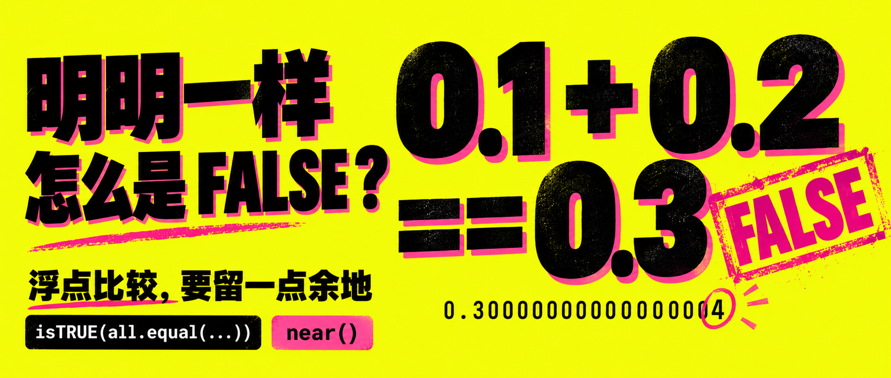
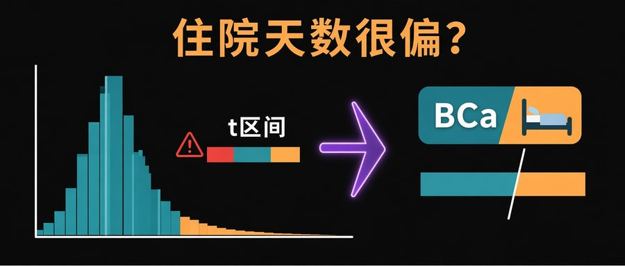
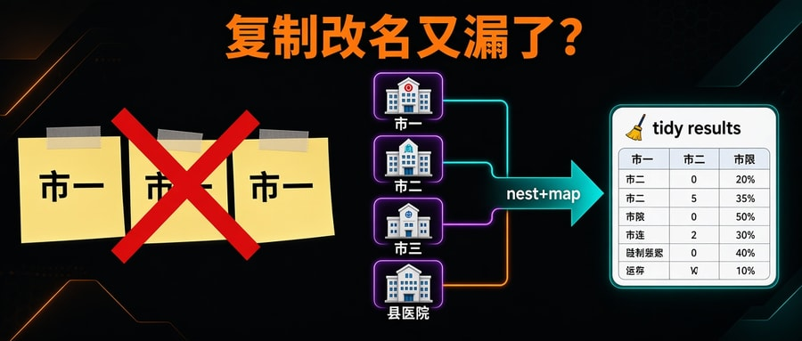
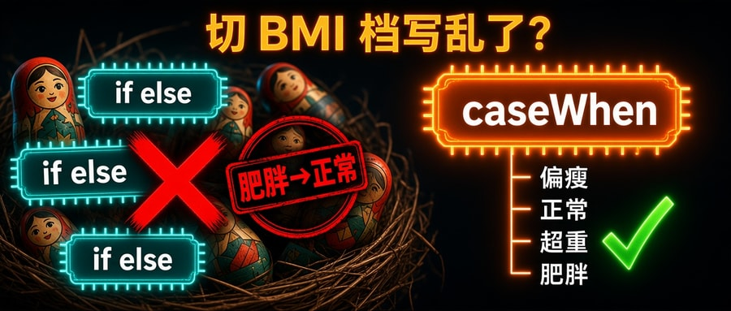
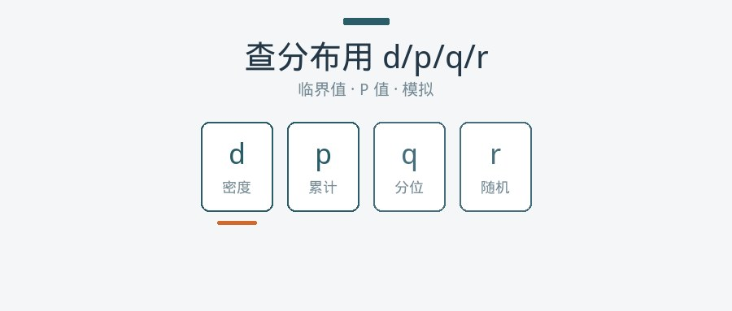
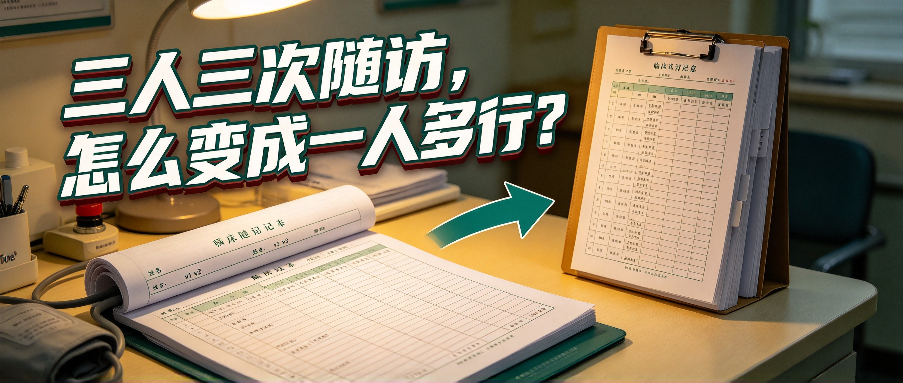
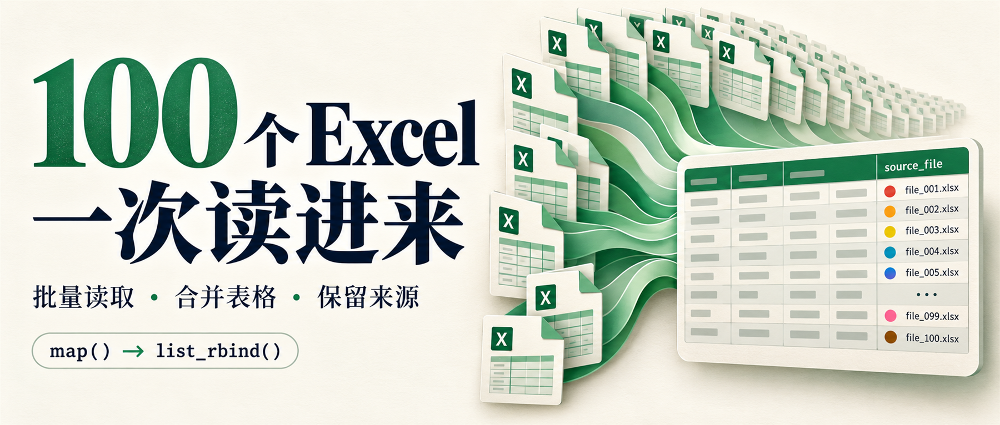

# RPost 封面一览

> 由 `cover/cover.json` 生成；改清单后运行 `node scripts/update-cover-md.mjs`。
>
> 合计 **13** 篇 · 已启用 **13** · 待制作（inactive）**0**

## R语言师兄脚本换台电脑就挂：用 renv 锁住包版本

- id：`20261007-renv-lockfile`
- 状态：**启用**
- 文件：`images/20261007-renv-lockfile-imagegen-v1.png`


- prompt：

```text
Use case ads-marketing. Create ONE finished Chinese WeChat editorial cover at target 1800×766 pixels, 2.35:1 ultrawide. Topic: R renv records package names and versions in renv.lock and restores those versions on another computer. It does not reinstall R or save analysis data. Art direction: sophisticated midnight-blue Swiss engineering poster, precise electric-cyan linework, silver embossed details, luminous warm amber accents, lightly textured technical drafting paper, confident contemporary condensed Chinese sans typography. This should feel like a collectible architectural blueprint poster, NOT a cream paper-card design. Very large headline across upper left verbatim on two lines: "换台电脑" / "包版本照旧". Main illustration integrated to the right: two elegant outlined laptop silhouettes, a central tall amber-edged manifest document labeled exactly "renv.lock", with a single row "dplyr 1.1.4", and the two laptops each showing a small matching cyan package cube labeled "dplyr 1.1.4". Fine directed circuit-like paths travel from the manifest to both matching cubes, expressing exact package-version restoration. Subtle large typographic word "renv" in the background lower right as a graphic element, no extra words. Small bottom left label exact "记录版本 · 按锁恢复". Small code strip exact "snapshot() → restore()". Balanced typography, controlled negative space, visually striking engineering precision, no clutter, no photoreal broken computer, no huge padlock cliché, no code wall, no watermark. All crucial text inside 6 percent safe margins, clear at 900×383. No implication that renv guarantees identical data results or locks R itself.
```

> 内置 imagegen；1800×766；逐篇阅读正文后制作，文字与内容已核验。

## R语言里两个数明明一样，用 == 却是 FALSE

- id：`20261007-float-equality-near`
- 状态：**启用**
- 文件：`images/20261007-float-equality-near-imagegen-v1.png`



- prompt：

```text
Use case ads-marketing. ONE finished Chinese R tutorial cover, target 1800×766 pixels, 2.35:1 ultrawide. Topic floating point equality: 0.1+0.2==0.3 is FALSE because of binary rounding; isTRUE(all.equal(...)) or dplyr::near compare with tolerance. Visually adventurous premium typographic pop-art poster with oversized typography, fluorescent acid-yellow background, matte near-black chunky sans-serif type, vivid hot-pink accents, subtle risograph print texture and stylish offset shadows. No cream paper card aesthetic, no technical blueprint, no stock computer. Large headline at upper left exact two lines "明明一样" / "怎么是 FALSE？". Center-right an enormous sculptural black equation "0.1 + 0.2" above "== 0.3", with a hot-pink diagonal ink stamp "FALSE" beside it. Under the equation a precise small monospace line "0.30000000000000004" with only final 4 circled in pink, revealing the tiny hidden discrepancy. At lower left place a short controlled black-on-yellow subline exactly "浮点比较，要留一点余地". A compact black footer tag with white text exact "isTRUE(all.equal(...))" and a separate smaller pink tag "near()". These labels indicate methods, not executable full code. Bold graphic balance, tightly art-directed, generous space around text, important elements inside 6 percent margins, superb thumbnail legibility. No extra equations, no contradictory TRUE label on exact equality, no gradients or scattered icons, no watermarks, no random copy. Chinese must be exact.
```

> 内置 imagegen；1800×766；逐篇阅读正文后制作，文字与内容已核验。

## R语言Excel两层表头怎么读：先拆格子再拼成长表

- id：`20261007-excel-multiheader-unpivotr`
- 状态：**启用**
- 文件：`images/20261007-excel-multiheader-unpivotr-imagegen-v1.png`


- prompt：

```text
Create one finished Chinese editorial cover for R article, 1800×766 target, ultra-wide 2.35:1. Topic: Excel has TWO header rows: merged group headers 基线 / 随访 over metric headers 收缩压 / 舒张压; unpivotr as_cells() and behead() unpack cells and assign headers, yielding tidy long table. Visual style: delightful tactile stop-motion clay and painted wooden educational blocks, soft blush pink background, peach, deep forest green and lilac blocks, museum-quality still life with soft window lighting and beautiful realistic material texture. Distinct from paper-card, neon, and blueprint designs. Bold rounded dark forest green Chinese headline at upper left verbatim "两层表头" and beneath "拆开就好读". Supporting line bottom left exact "先拆格子，再拼成长表". Small neat code label "as_cells() → behead()". Right two-thirds of composition features a carefully constructed sculptural spreadsheet made of stacked clay tiles: two broad top header blocks labelled 基线 and 随访, each over two smaller blocks labelled 收缩压 and 舒张压. Below, a single row of four corresponding number tiles 120,80,118,78, in that exact order. Some tiles lift upward in a gentle exploded-view, physically revealing the two header tiers; subtle color-coded small ribbons lead to a compact orderly output tile column with ONLY four rows, exact labels "基线 · 收缩压 · 120", "基线 · 舒张压 · 80", "随访 · 收缩压 · 118", "随访 · 舒张压 · 78". Avoid over-detailed UI; main art is physical clay spreadsheet being neatly disassembled and reassembled. Ensure typography is large enough and headers legible, clear separation of headline and visual, no text overlapping, 6 percent safe margins. No people, watermark, extra slogans, messy decorative icons, code walls or shiny plastic. Elegant playful magazine still life, not kindergarten infographic.
```

> 内置 imagegen；1800×766；逐篇阅读正文后制作，文字与内容已核验。

## R语言住院天数很偏，t 置信区间不够稳时用 bootstrap

- id：`20261007-bootstrap-bca-skew`
- 状态：**启用**
- 文件：`images/20261007-bootstrap-bca-skew.jpg`



- prompt：

```text
LAYOUT MASK：白空、只画黑带；黑带内四周留 margin。油管缩略图。钩子「住院天数很偏？」。右偏住院天数直方图+警告「t区间」 vs BCa 徽章+病床。暖橙+青绿。无代码墙、无水印。
```

> automation regen 2026-10-07

## R语言按分组各跑一遍分析：每家医院一个回归

- id：`20261006-repeat-analysis-by-group`
- 状态：**启用**
- 文件：`images/20261006-repeat-analysis-by-group.jpg`



- prompt：

```text
LAYOUT MASK：白空、只画黑带；黑带内四周留 margin。油管缩略图。钩子「复制改名又漏了？」。三张都写市一的便利贴+红叉 vs 四家医院→nest+map→tidy results。暖橙+青绿。无代码墙、无水印。
```

> automation regen 2026-10-07

## R语言给变量重新分组：从 ifelse 到 case_when

- id：`20261006-recode-ifelse-case-when`
- 状态：**启用**
- 文件：`images/20261006-recode-ifelse-case-when.jpg`



- prompt：

```text
LAYOUT MASK：白空、只画黑带；黑带内四周留 margin。油管缩略图。钩子「切 BMI 档写乱了？」。左侧嵌套套娃+三枚 ifelse 芯片+红戳「肥胖→正常」+红叉；右侧 case_when 芯片+偏瘦/正常/超重/肥胖阶梯+绿勾。暖橙+青绿。无代码墙、无水印。
```

> automation fill 2026-10-07

## R语言 d/p/q/r 四个函数：查临界值、算 P 值、造模拟数据

- id：`20261006-dpqr-distributions`
- 状态：**启用**
- 文件：`images/20261006-dpqr-distributions.jpg`



- prompt：

```text
LAYOUT MASK：白空、只画黑带；黑带内四周留 margin。油管缩略图。钩子「不翻表查 1.96？」。翻飞统计表+红叉 vs qnorm→1.96 徽章+d/p/q/r 芯片+骰子+正态曲线轮廓+绿勾。暖橙+青绿。无代码墙、无水印。
```

> automation fill 2026-10-07

## R语言：同一批人测了三次，分数还不正态，怎么比？

- id：`20261005-friedman-repeated-scores`
- 状态：**启用**
- 文件：`images/20261005-friedman-repeated-scores.jpg`


- prompt：

```text
LAYOUT MASK：白空、只画黑带；黑带内四周留 margin。油管缩略图。钩子「三次疼痛分不正态？」。同一病人三表盘术前/术后1天/术后7天+ANOVA 红叉 vs Friedman+Wilcoxon 奖牌排名+绿勾。暖橙+青绿。无代码墙、无水印。
```

> automation fill 2026-10-07

## R 语言里随访宽表怎么转成长表

- id：`20260927-wide-to-long`
- 状态：**启用**
- 文件：`images/20260927-wide-to-long.jpg`



- prompt：

```text
比例 2.35:1，至少 1800×766，横版封面，无水印；禁止 16:9；只出 1 张终稿。
YouTube 缩略图风，超粗立体钩子，轻微浮动柔光。核心：随访宽表→长表。
大字钩子：「三人三次随访，怎么变成一人多行？」
画面描述：诊所桌一角，血压记录本摊开成宽表（姓名一行、v1 v2 v3 横格）；旁边直立的病历夹里同一人记录变成多页竖翻（一人多行）。钩子压在画面上半。暖临床灯光，青绿点缀即可但不抢戏。
```

> pick q1-opt D 诊所病历; doubao-download after ext reload; chat 38445842652880642; hook 三人三次随访怎么变成一人多行

## 如何用正则从字符串里提取数据

- id：`20260927-regex-extract-data`
- 状态：**启用**
- 文件：`images/20260927-regex-extract-data-imagegen-v1.png`


- prompt：

```text
Create a finished Chinese editorial cover for an R programming article about extracting data with regular expressions. Ultrawide 2.35:1, target exact 1800×766 pixels. Use case ads-marketing. Part of a premium editorial series: warm ivory paper grain background, huge dark navy Chinese serif typography, dimensional paper strips and cards, beautiful soft studio shadows and generous negative space. This edition uses warm burnt-orange accents with small teal highlights. Left 48 percent headline, right 52 percent a tactile sculptural diagram illustrating extracting meaningful substrings into fields. Headline verbatim two lines: "用正则" then "把数据提出来". "正则" and key emphasis orange, rest deep navy. Supporting text verbatim: "提关键词 · 拆文件名 · 取字段". Small code pill verbatim "regexec() → regmatches()". Right illustration: a long floating cream paper strip with exact string "随访_华东_202409.xlsx", with 华东 highlighted in teal and 202409 highlighted in orange. These two highlighted portions visually detach as neat paper tiles, connected by two elegant paper ribbons or thin curved arrows to a clean small two-column data table below. Table column headers verbatim "地区" and "年月", with three rows: "华东" and "202409"; "华北" and "202410"; "华南" and "202411". Teal accents for the region column and orange accents for the date column. Small matching capture parentheses surrounding the two highlighted chunks imply capture groups; avoid complicated full regex strings. The illustration must clearly communicate pulling pieces OUT OF text and arranging into columns, not just searching or filtering files. Keep the information sparse and coherent with no extra labels. Readable at 900×383, important content inside 6 percent safe margins, full bleed. No robot, humans, magnifying glass, watermark, mockup frame, or excessive decorative symbols. Sophisticated print magazine cover, never a UI screenshot.
```

> 内置 imagegen；1800×766；逐篇阅读正文后制作，文字与内容已核验。

## 一百个 Excel 怎么一次读进来

- id：`20260927-batch-read-without-for`
- 状态：**启用**
- 文件：`images/20260927-batch-read-without-for-imagegen-v1.png`



- prompt：

```text
Use case: ads-marketing. Create a polished Chinese editorial cover for an R programming article. Output exact 1800×766 pixels, ultrawide aspect ratio approximately 2.35:1, full bleed. Article is about reading one hundred Excel files with readxl and purrr map, combining them with list_rbind and keeping a source-file column. Main text verbatim on two lines: "100 个 Excel" and "一次读进来". Small supporting text verbatim: "批量读取 · 合并表格 · 保留来源". Small code label "map() → list_rbind()". Design a confident, elegant, highly legible editorial composition with large dark navy Chinese typography on warm off-white, a huge green 100 as part of the headline, and a beautiful dimensional paper illustration of many green spreadsheet cards flowing together into one organized larger table, whose source column has distinct colored row markers to express provenance. Restrained emerald green, cream and deep navy palette, subtle paper grain and soft shadows, sophisticated print magazine feel. Text occupies roughly left half and metaphor illustration right half with balanced generous whitespace, all crucial material inside 7 percent safe margins. Readable at 900×383. No people, no robots, no stock photo, no visual clutter, no extra slogans, no watermarks, no mockup border. This is a finished flat cover graphic.
```

> 内置 imagegen；1800×766；逐篇阅读正文后制作，文字与内容已核验。

## 啥是正则表达式？先会认文本形状

- id：`20260921-regex-real-world`
- 状态：**启用**
- 文件：`images/20260921-regex-real-world-imagegen-v1.png`


- prompt：

```text
Create a finished Chinese editorial cover, ultrawide 2.35:1, target 1800×766 pixels. Use case ads-marketing for an R programming article teaching regular expressions as matching text shapes, with filename filtering as the visual example. Elegant print magazine design: warm ivory paper grain background, very large dark navy Chinese serif typography, cobalt blue accent, tactile dimensional paper cards, soft studio shadows, spacious precise composition. Left 48 percent is headline, right 52 percent explanatory illustration. Headline verbatim two lines: "啥是正则表达式？" then "先认文本形状". First line can be smaller to fit, second line bold blue focal point. Supporting text verbatim: "认形状 · 筛文件 · 改文本". Small pill label "pattern → grepl()". On the right show a beautiful layered fan of filename paper strips passing through a translucent blue rectangular matching frame. Two selected strips have blue highlights and neat check marks: "随访_华东_202409.xlsx" and "随访_华北_202410.xlsx". Two unselected quieter gray strips below: "readme.txt" and "随访_backup.csv". Blue highlight the prefix 随访_ and suffix .xlsx of matched files. Show a small blue floating rule card with only "^  .*  $" clearly printed as syntax symbols. This communicates recognizing the shape of names, NOT extracting individual fields. No robot, no magnifying glass cliché, no humans, no additional copy, no watermark, no border. All headline text readable at half resolution, important content within 6 percent margins. Premium editorial cover with sculptural paper depth, not a screenshot or busy instructional chart.
```

> 内置 imagegen；1800×766；逐篇阅读正文后制作，文字与内容已核验。

## 分析做到一半如何存临时数据？

- id：`20260921-r-save-five-methods`
- 状态：**启用**
- 文件：`images/20260921-r-save-five-methods.jpg`


- prompt：

```text
比例 2.35:1，成品像素 900×383，横版封面，无水印；只出 1 张终稿，不要中间稿。
油管/B站缩略图风，高对比大字钩子：「做到一半，怎么存？」
冲突画面：左侧分析做到一半的乱桌（半截清洗表、时钟、下班压力）；右侧五条清晰保存路径图标——RDS、Excel、CSV、save()、save.image()，暖橙对青绿。
不要代码墙、公式墙、水印、二维码、小图拼版、虚线外框。
```

> doubao keep 3008x1280 2026-10-07
